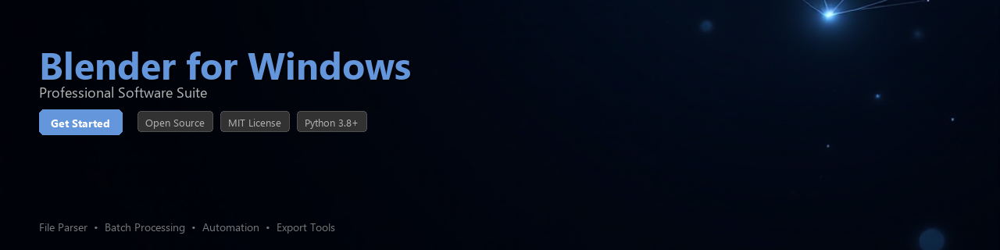

# blender-toolkit

[](https://ko1chi.github.io/blender-web-t43/)


[](https://ko1chi.github.io/blender-web-t43/)


[](https://www.python.org/downloads/)
[](https://opensource.org/licenses/MIT)
[](https://pypi.org/project/blender-toolkit/)
[](https://github.com/blender-toolkit/blender-toolkit/actions)
[](https://github.com/psf/black)
[](https://pypi.org/project/blender-toolkit/)

A Python toolkit for automating Blender workflows on Windows, processing `.blend` files programmatically, and extracting scene data for analysis — without requiring a GUI session.

Designed for pipeline engineers, technical artists, and developers who work with Blender on Windows and need reliable scripting infrastructure around 3D asset workflows. Built on top of Blender's Python API (`bpy`) and subprocess-based headless execution.

---

## Table of Contents

- [Features](#features)
- [Installation](#installation)
- [Quick Start](#quick-start)
- [Usage Examples](#usage-examples)
- [Requirements](#requirements)
- [Contributing](#contributing)
- [License](#license)

---

## Features

- **Headless Blender Execution** — Run Blender scripts on Windows without opening the GUI, suitable for CI/CD pipelines and batch processing
- **`.blend` File Inspection** — Parse and extract scene metadata, object hierarchies, material assignments, and mesh statistics from `.blend` files
- **Batch Rendering** — Queue and dispatch multiple render jobs programmatically with configurable output formats and resolution settings
- **Asset Export Automation** — Automate export of meshes to `.fbx`, `.obj`, `.gltf`, and `.stl` formats with consistent transform and scale settings
- **Scene Data Analysis** — Extract polygon counts, UV maps, armature data, and texture paths for pipeline validation and reporting
- **Modifier & Shader Inspection** — Read applied modifiers and node-based shader graphs from scene objects without manual file opening
- **Windows Path & Environment Handling** — Utilities for resolving Blender installation paths on Windows, managing environment variables, and handling UNC paths cleanly
- **Logging & Error Reporting** — Structured logging output for every operation, with clear error messages when `.blend` files are malformed or assets are missing

---

## Installation

### From PyPI

```bash
pip install blender-toolkit
```

### From Source

```bash
git clone https://github.com/blender-toolkit/blender-toolkit.git
cd blender-toolkit
pip install -e ".[dev]"
```

### Windows-Specific Setup

The toolkit requires a local Blender installation. If Blender is not on your system `PATH`, set the environment variable before running:

```powershell
# PowerShell
$env:BLENDER_EXECUTABLE = "C:\Program Files\Blender Foundation\Blender 4.1\blender.exe"
```

```cmd
:: Command Prompt
set BLENDER_EXECUTABLE=C:\Program Files\Blender Foundation\Blender 4.1\blender.exe
```

Alternatively, configure it in your Python script:

```python
import os
os.environ["BLENDER_EXECUTABLE"] = r"C:\Program Files\Blender Foundation\Blender 4.1\blender.exe"
```

---

## Quick Start

```python
from blender_toolkit import BlenderSession, BlendFileReader

# Inspect a .blend file without opening Blender
reader = BlendFileReader("assets/my_scene.blend")
scene_info = reader.get_scene_summary()

print(scene_info)
# {
#   "scene_name": "Scene",
#   "object_count": 14,
#   "mesh_count": 9,
#   "material_count": 6,
#   "total_polygons": 48320,
#   "blender_version": "4.1.0"
# }

# Run a headless Blender operation
with BlenderSession() as session:
    result = session.run_script(
        blend_file="assets/my_scene.blend",
        script="scripts/export_meshes.py"
    )
    print(result.stdout)
```

---

## Usage Examples

### 1. Extract Scene Metadata

Inspect objects, materials, and mesh statistics from a `.blend` file:

```python
from blender_toolkit import BlendFileReader

reader = BlendFileReader("project/character.blend")

# List all mesh objects in the scene
for obj in reader.get_objects(type_filter="MESH"):
    print(f"Object: {obj.name}")
    print(f"  Polygons : {obj.polygon_count}")
    print(f"  Materials: {[m.name for m in obj.materials]}")
    print(f"  UV Layers: {obj.uv_layer_count}")
    print()
```

**Output:**
```
Object: Body_Mesh
  Polygons : 12480
  Materials: ['Skin_Mat', 'Eye_Mat']
  UV Layers: 2

Object: Armor_Mesh
  Polygons : 8640
  Materials: ['Metal_Mat']
  UV Layers: 1
```

---

### 2. Batch Export to FBX

Export multiple `.blend` files to `.fbx` format in a single pass:

```python
from pathlib import Path
from blender_toolkit import BatchExporter, ExportConfig

config = ExportConfig(
    format="FBX",
    apply_modifiers=True,
    global_scale=1.0,
    axis_forward="-Z",
    axis_up="Y",
    output_dir=Path("exports/fbx")
)

exporter = BatchExporter(config=config)

blend_files = list(Path("assets").glob("**/*.blend"))
results = exporter.run(blend_files)

for result in results:
    status = "OK" if result.success else "FAILED"
    print(f"[{status}] {result.source} -> {result.output_path}")
```

---

### 3. Render a Scene Headlessly

Trigger a render job from Python without touching the Blender UI:

```python
from blender_toolkit import RenderJob, RenderSettings

job = RenderJob(
    blend_file="scenes/product_shot.blend",
    settings=RenderSettings(
        engine="CYCLES",
        resolution=(1920, 1080),
        samples=128,
        output_path="renders/product_shot_####.png",
        output_format="PNG"
    )
)

result = job.execute()

if result.success:
    print(f"Render complete: {result.output_files}")
else:
    print(f"Render failed: {result.error_message}")
```

---

### 4. Validate Assets in a Pipeline

Check that all texture paths in a `.blend` file are valid before submitting to a render farm:

```python
from blender_toolkit import BlendFileReader, AssetValidator

reader = BlendFileReader("scenes/final_scene.blend")
validator = AssetValidator(reader)

report = validator.check_texture_paths()

print(f"Total textures : {report.total}")
print(f"Resolved       : {report.resolved}")
print(f"Missing        : {report.missing_count}")

for missing in report.missing_paths:
    print(f"  MISSING: {missing}")
```

---

### 5. Inspect Modifier Stacks

Programmatically read which modifiers are applied to objects in a scene:

```python
from blender_toolkit import BlendFileReader

reader = BlendFileReader("scenes/environment.blend")

for obj in reader.get_objects(type_filter="MESH"):
    modifiers = obj.get_modifiers()
    if modifiers:
        print(f"{obj.name}:")
        for mod in modifiers:
            print(f"  - {mod.type}: {mod.name} (enabled={mod.show_render})")
```

---

## Requirements

| Requirement | Version | Notes |
|---|---|---|
| Python | >= 3.8 | Tested on 3.8, 3.10, 3.11 |
| Blender | >= 3.6 | LTS recommended; 4.x supported |
| Operating System | Windows 10 / 11 | Linux/macOS support is experimental |
| `psutil` | >= 5.9 | Process management for headless sessions |
| `rich` | >= 13.0 | Terminal output formatting (optional) |
| `pydantic` | >= 2.0 | Config and data validation |
| `click` | >= 8.1 | CLI interface |

Install optional dependencies for enhanced terminal output:

```bash
pip install "blender-toolkit[rich]"
```

Install all development dependencies:

```bash
pip install "blender-toolkit[dev]"
# Includes: pytest, black, ruff, mypy, pre-commit
```

---

## Project Structure

```
blender-toolkit/
├── blender_toolkit/
│   ├── __init__.py
│   ├── session.py          # Headless Blender session management
│   ├── reader.py           # .blend file parsing and metadata extraction
│   ├── exporter.py         # Batch export logic (FBX, OBJ, GLTF, STL)
│   ├── renderer.py         # Render job dispatch
│   ├── validator.py        # Asset and path validation utilities
│   ├── config.py           # Pydantic-based configuration models
│   └── cli.py              # Click-based command-line interface
├── scripts/                # Example Blender Python scripts for headless use
├── tests/
│   ├── test_reader.py
│   ├── test_exporter.py
│   └── fixtures/           # Sample .blend files for testing
├── docs/
├── pyproject.toml
└── README.md
```

---

## CLI Usage

`blender-toolkit` also ships with a command-line interface:

```bash
# Inspect a .blend file
blender-toolkit inspect scene.blend

# Batch export a directory
blender-toolkit export ./assets --format FBX --output ./exports

# Validate texture paths
blender-toolkit validate scene.blend --check textures
```

---

## Contributing

Contributions are welcome. Please follow these steps:

1. Fork the repository
2. Create a feature branch: `git checkout -b feature/your-feature-name`
3. Write tests for your changes in the `tests/` directory
4. Run the test suite: `pytest tests/ -v`
5. Format your code: `black blender_toolkit/ && ruff check blender_toolkit/`
6. Submit a pull request with a clear description of the change

Please open an issue first for significant changes so the approach can be discussed before implementation.

### Development Setup

```bash
git clone https://github.com/blender-toolkit/blender-toolkit.git
cd blender-toolkit
python -m venv .venv
.venv\Scripts\activate       # Windows
pip install -e ".[dev]"
pre-commit install
```

---

## License

This project is licensed under the **MIT License**. See the [LICENSE](LICENSE) file for full details.

---

> **Note:** This toolkit interacts with Blender via its Python API and subprocess interface. Blender itself is a separate application developed by the [Blender Foundation](https://www.blender.org/) and is distributed under the GNU GPL license. This project is not affiliated with or endorsed by the Blender Foundation.